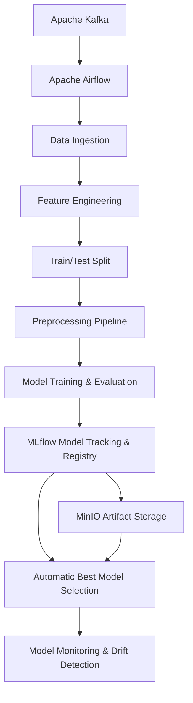
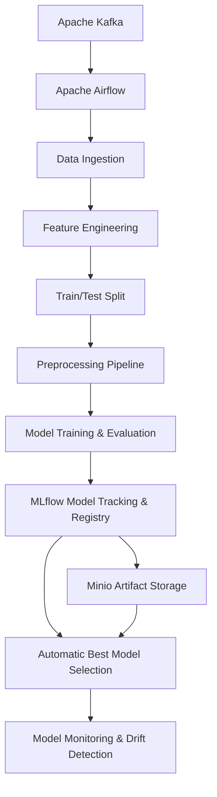
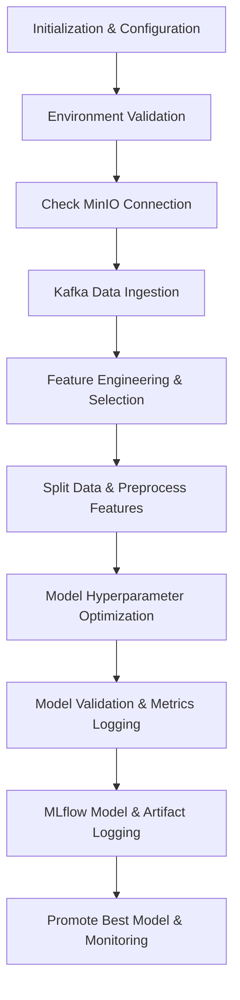
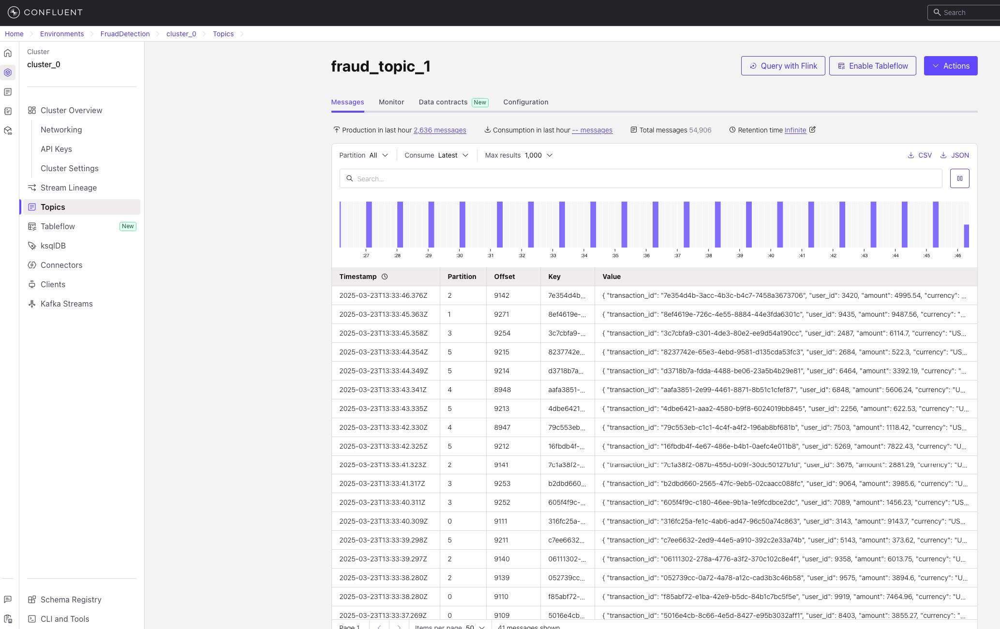

# Realtime Fraud Detection Model using Airflow, Mlflow on Kafka
## Overview
This implementation provides a robust and production-grade **automated pipeline** built to reliably train, deploy, and continuously monitor fraud detection machine learning models. Leveraging industry-standard ML Ops tools like Apache Airflow, Kafka, MLflow, and MinIO, this pipeline ensures high-quality outcomes and streamlined workflow management.
## Key Architectural Principles
The system is thoughtfully designed with these foundational principles:
### 🔑 Environment Agnostic Configuration
- **Flexible Config Management:** Utilizes YAML configuration files (`config.yaml`) to define environment-specific non-secret parameters.
- **Secrets Management:** Provides strict separation of sensitive credentials from configuration using `.env` files (dotenv).
- **Multi-Environment Support:** Adaptable to multiple deployment scenarios (Development, Testing, Production) seamlessly.

### 📊 Observability & Monitoring
- **Structured Logging:** Implements structured logging for efficient debugging and observability across multiple configurable sinks.
- **Experiment Tracking:** Leverages MLflow to systematically track experiments, metrics, parameters, and results.
- **Artifact Management:** Uses MinIO, a robust, S3-compatible storage service, for secure artifact management and reliable storage.

### 🚀 Production Readiness
- **Real-time Data Ingestion:** Integrates Apache Kafka for reliable, real-time data streaming.
- **Automated Hyperparameter Tuning:** Systematic hyperparameter optimization using grid/random search methods to identify optimal model configurations.
- **Model Management:** Automatic serialization, registry, and deployment practices via MLflow Model Registry.
- **Class Imbalance Handling:** Applies advanced methods such as SMOTE and custom resampling strategies to mitigate class imbalance issues proactively.

### ⚠️ Operational Safety
- **Environment Validation Checks:** Provides pre-execution environmental validation to detect misconfigurations early.
- **Data Quality Controls:** Implements comprehensive checks and guards around data quality to ensure consistent results.
- **Robust Error Handling:** Comprehensive runtime error detection, logging, alerting, and recovery frameworks.
- **Performance Baselining:** Establishes reliable baseline metrics for consistent evaluation of model improvements and regressions.

## System Architecture
The pipeline architecture visualizes key interactions among deployed services:

## Detailed Pipeline Workflow
### 1️⃣ Data Ingestion
- Kafka integration ensures real-time streaming and ingestion of transactional data with high reliability and scalability.

### 2️⃣ Feature Engineering (`create_features`)
This step greatly influences the accuracy of your model:
- **Data Cleansing:** Handles missing values and standardizes data types.
- **Feature Extraction:** Derives numerical, categorical, and temporal features from raw data streams.
- **Feature Optimization:** Selects critical predictive features through statistical analyses, improving model performance and reducing noise and redundancy.

### 3️⃣ Train/Test Split & Preprocessing
- Explicitly managed dataset partitions support unbiased training and validation sets.
- Preprocessing integrates advanced data scaling, categorical encoding, and class imbalance management through a custom preprocessing pipeline (`ImbPipeline`).


# Fraud Detection Training Pipeline
## Overview
This project provides a robust **automated pipeline** designed for training, deploying, and continuously monitoring fraud detection machine learning models. It leverages powerful ML operations tools such as Apache Airflow, Kafka, MLflow, and Minio to deliver streamlined workflow management and real-time insights.
## Architecture
The architecture visualizes the interaction between different services within this pipeline:

## Detailed Workflow
### 1. Read Data from Apache Kafka
- Transactional event data streams are ingested from Kafka topics continuously into the pipeline.

### 2. Feature Engineering (`create_features` Method)
- **Data Cleansing and Preparation**
    - Filters and cleans transaction data ensuring high-quality feature inputs.
    - Converts data types, handles missing values, and applies necessary transformations.

- **Feature Generation**
    - Performs aggregation and derivation of numerical, categorical, and time-based features from raw transaction data.

- **Feature Selection and Optimization**
    - Selectively reduces features based on their contribution toward detecting fraud, enhancing accuracy and reducing complexity.

### 3. Dataset Split (Train and Test)
- Ensures unbiased evaluation and effective validation of model performance using systematically partitioned train/test data splits.

### 4. Preprocessing Pipeline
- Integrates standardized data preprocessing techniques provided by scikit-learn and Imbalanced-learn (`ImbPipeline`) including:
    - Data imbalances handling via resampling strategies.
    - Normalization and scaling numerical features.
    - Encoding categorical variables efficiently.

### 5. Model Training and Evaluation (`train_model` Method)
- **Automated Training**
    - Executes training algorithms (Random Forest, XGBoost, etc.) across the processed and prepared datasets.

- **MLflow Integration**
    - Logs comprehensive training metrics (Precision, Recall, AUC), hyperparameters, and models directly into MLflow.
    - Stores preprocessing pipelines and relevant scripts alongside models ensuring ease of reproducibility and version control.

- **Model Validation**
    - Employs cross-validation and validation datasets to ensure robust estimates of out-of-sample performance.
    - Generates interpretable reports on feature importance and critical model insights for stakeholders.

### 6. Automatic Model Selection with MLflow
- Automatically promotes and deploys the best-performing model based on predefined performance threshold metrics via MLflow Model Registry.

### 7. MLflow Model Drift Monitoring
- Provides vigilant monitoring to detect model drift promptly, allowing rapid response to data shifts and retraining requirements.


## Feature Engineering Process (`create_features` Method)
The feature engineering phase significantly impacts model performance by systematically converting raw transaction data into meaningful features. The `create_features` method encapsulates the following comprehensive steps:
### 1. Data Cleansing and Validation
- **Missing Value Handling:** Identification and strategic imputation or removal of missing values based on predefined thresholds.
- **Data Type Standardization:** Ensuring transactional datasets adhere strictly to consistent data types (e.g., date-time conversion, numerical, categorical encoding).
- **Outlier Detection:** Automated detection and handling of anomalous values affecting model reliability.

### 2. Feature Generation Strategies
- **Temporal Features Extraction:** Creation of time-specific features such as transaction frequencies, elapsed time between transactions, and trends occurring within defined timeframes.
- **Aggregation Features:** Grouping raw transactions by meaningful business identifiers (e.g., customer ID, account number) to extract insightful metrics like average transaction amount, maximum and minimum values, transaction variance, and activity frequencies.
- **Categorical Feature Encoding:** Intelligent encoding of categorical attributes (e.g., merchant category, transaction type) using One-Hot Encoding, Label Encoding, or Target Encoding suited best for your modelling strategy.

### 3. Feature Optimization and Selection
- **Correlation Analysis:** Examination of numerical feature inter-correlation, ensuring selected features add distinctive and non-redundant information.
- **Statistical Relevance Testing:** Utilization of statistical tests and metrics to prioritize and select features significantly associated with fraud-detection targets (such as Chi-square, mutual information scores).

### 4. Consolidation and Strategy
- Combination and structuring of optimized features into a coherent data frame explicitly dedicated to achieving the project’s objective of robust fraud detection.

This rigorous feature engineering process ensures the resulting model has high-quality inputs, directly leading to superior performance and reliability in fraud detection outcomes.


### Steps to Train the Fraud Detection Model
**Step 1: Configure Apache Airflow Environment**
- Setup connections and provide required parameters according to `config.yaml`.

**Step 2: Trigger Training DAG**
- From the Airflow interface, trigger the DAG (`fraud_detection_training_dag`). Scheduling recurring routine executions is also possible.

**Step 3: Execution Monitoring**
- Monitor task status via Airflow UI and investigate any anomalies through logs.

**Step 4: MLflow Model Validation**
- Validate training outcomes in MLflow UI, verifying metrics capture, model artifacts storage, and accurate registrations.

**Step 5: Continuous Drift Monitoring**
- Regularly review and act upon drift alerts provided by MLflow integrations.

## Docker Compose Management
This project uses Docker Compose to simplify service management seamlessly.
**Start Core Services**
``` bash
docker-compose up -d
```
**Stop All Services**
``` bash
docker-compose down
```
**Check Status**
``` bash
docker-compose ps
```
### Additional Docker Compose Commands and Resources
Run specific profiles, build if necessary, and manage data volumes using the following commands:
``` bash
docker compose --profile flower up -d --build
docker compose down -v
docker compose --profile flower down
```
These commands enable precise control of container states and cleanup procedures.

# Detailed Explanation of `fraud_detection_training.py`
This document explains the logic, methods, and behavior of key components in the provided Python script `fraud_detection_training.py`. All explanations are structured block-by-block.
## 📌 Class: `FraudDetectionTraining`
This class orchestrates the entire fraud detection model training lifecycle clearly and robustly.
## 🔹 Attributes and Imports
- **`plt` **: Likely refers to matplotlib's `pyplot` module used for visualizing data and model results.
- **`np` **: NumPy library, utilized for mathematical computations and organized arrays or matrices.
- **`pd` **: Pandas library, central to data manipulation, loading, cleaning, and analysis.
- **`ImbPipeline` **: Import from `imblearn.pipeline`; supports preprocessing pipelines specifically designed for handling imbalanced datasets.
- **`logger` **: An instance providing structured logging—captures execution details, progress, and warnings/errors systematically.

## ✅ Method: `__init__`
**Purpose**: Constructor; initializes configurations, validates setup, and confirms necessary resource connections.
**Key Activities**:
- Loads configuration files.
- Calls environment and dependency validation methods ensuring readiness.
- Sets up any initial variables or state necessary for subsequent methods.

## 📚 Method: `_load_config`
**Purpose**: Reads configuration data from external YAML configuration files.
**Key Activities**:
- Accesses YAML configuration file for parameterization of training pipeline (paths, model hyperparameters, Kafka connection properties, etc.).
- Populates internal configuration dictionary accessible across the class methods.

**Benefit**:
- Allows flexible, environment-specific setups without hardcoding sensitive or variable parameters directly in code.

## 🔍 Method: `_validate_environment`
**Purpose**: Ensures the training environment adheres strictly to requirements, avoiding runtime exceptions.
**Key Activities**:
- Checks Python environment, ensures dependencies and libraries are correctly installed at necessary versions.
- Verifies required environment variables and paths.
- Reports or throws clear error messages if validation fails.

**Benefit**:
- Pre-emptively identifies issues before executing core methods, providing clear logs and messages.

## 🌐 Method: `_check_minio_connection`
**Purpose**: Checks connectivity to MinIO (object storage), used for secure, reliable storage for ML artifacts.
**Key Activities**:
- Attempts direct connection to MinIO storage endpoint specified in configuration.
- Ensures S3-compatible MinIO storage access, credentials, and permissions are valid.
- Logs results or errors of the connection attempt clearly.

**Benefit**:
- Assures artifact serialization/storage and model registry functions operate without unexpected interruptions.

## 📥 Method: `read_from_kafka`
**Purpose**: Consumes streaming transaction data from Apache Kafka for real-time model training.
**Key Activities**:
- Configures consumer with Kafka topics, bootstrap servers, and relevant settings.
- Consumes messages continually, assembling them into structured Pandas DataFrames for downstream steps.
- Includes robust error-handling and logging to ensure reliable data flow.

**Benefit**:
- Real-time ingestion enables models trained on the freshest transactions, enhancing fraud detection agility and accuracy.

## 🛠️ Method: `create_features`
**Purpose**: Transforms raw transaction data into meaningful predictive features, integral to model accuracy.
**Key Activities**:
- Performs vital data preprocessing (e.g., type conversion, missing value handling).
- Applies aggregation, categorical encoding, and derivation to create predictive features.
- Implements feature selection techniques to identify optimal subsets for modeling accuracy.

**Benefit**:
- Pre-processed, feature-rich inputs directly enhance model predictive power and interpretability.

## 🚀 Method: `train_model`
**Purpose**: Executes the complete model training pipeline including preprocessing, model fitting, parameter tuning, validation, and deployment integration.
**Key Activities**:
1. **Data Splitting**:
    - Splits feature-engineered data into distinct training and validation subsets according to configurations (e.g., 70/30 split or customized).

2. **Preprocessing Pipeline with ImbPipeline**:
    - Handles data imbalance (via oversampling methods like SMOTE).
    - Applies scaling transformations and encodes categorical features systematically, ensuring consistency.

3. **Hyperparameter Tuning (GridSearchCV)**:
    - Runs systematic hyperparameter optimization across algorithms (Random Forest, XGBoost, Logistic Regression, etc.) using cross-validation.
    - Finds optimal hyperparameters maximizing performance metrics (e.g., ROC-AUC).

4. **Model Evaluation**:
    - Computes robust validation metrics (ROC-AUC, precision, recall).
    - Provides detailed feature importance analyses, creating insights and interpretability beneficial to stakeholders.

5. **MLflow Integration**:
    - Logs comprehensive training metrics, best-found hyperparameters, and model artifacts directly into MLflow tracking system.
    - Registers the best-performing model automatically in MLflow Model Registry.

6. **Visualization & Reporting**:
    - Produces figures/graphics for important insights (e.g., feature importance plots logged as artifacts).
    - Ensures results documentation effectively supports consistent, transparent communication of findings.

**Benefit**:
- End-to-end automation accelerates model experimentation and drastically reduces deployment timelines while ensuring model quality and auditability.

## 📝 Summary of Pipeline Execution Flow:

## 🚩 Summary of Benefits Provided by this Script:
- Robust, production-grade routines for environment validation, reliable artifact storage.
- Easy-to-configure, environment-specific setup accommodating continuous integration and deployment practices.
- Proactive monitoring and detailed structured logging for straightforward troubleshooting.
- Transparent model traceability, reproducibility, and explainability with MLflow and MinIO.
- Real-time data ingestion capability enhances timeliness and accuracy in fraud detection systems.

## 🚀 Model Training (`train_model` Method) Detailed Explanation
### 🔧 Step-by-Step Model Training
1. **Dataset Splitting**
``` python
from sklearn.model_selection import train_test_split

X_train, X_val, y_train, y_val = train_test_split(
    features, targets, test_size=config["model"]["validation_split"], random_state=42
)
```
2. **Imbalanced Data Handling & Preprocessing**
``` python
from imblearn.pipeline import Pipeline as ImbPipeline
from imblearn.over_sampling import SMOTE
from sklearn.preprocessing import StandardScaler
from sklearn.ensemble import RandomForestClassifier

pipeline = ImbPipeline([
    ('sampling', SMOTE(random_state=42)),
    ('scaling', StandardScaler()),
    ('classifier', RandomForestClassifier())
])
```
3. **Hyperparameter Optimization**
``` python
from sklearn.model_selection import GridSearchCV

grid_params = {
    'classifier__n_estimators': [50, 100, 200],
    'classifier__max_depth': [5, 10, None],
}

grid_search = GridSearchCV(pipeline, grid_params, cv=5, scoring='roc_auc', verbose=2, n_jobs=-1)
grid_search.fit(X_train, y_train)
best_model = grid_search.best_estimator_
```
4. **Model Validation & Performance Metrics**
``` python
from sklearn.metrics import roc_auc_score, classification_report

predictions = best_model.predict(X_val)
roc_auc = roc_auc_score(y_val, predictions)

report = classification_report(y_val, predictions, target_names=["Not Fraud", "Fraud"])

logger.info(f"ROC-AUC: {roc_auc}")
logger.info(f"Classification Report:\n{report}")
```
5. **MLflow Experiment Logging**
``` python
import mlflow
import mlflow.sklearn

with mlflow.start_run(run_name="Fraud_Detection"):
    mlflow.log_params(grid_search.best_params_)
    mlflow.log_metric("roc_auc", roc_auc)
    mlflow.sklearn.log_model(best_model, "fraud_detection_model")
```
6. **Artifacts & Feature Importance**
``` python
import matplotlib.pyplot as plt

importances = best_model.named_steps["classifier"].feature_importances_

plt.figure(figsize=(10, 6))
plt.bar(features.columns, importances)
plt.xticks(rotation=90)
plt.title("Feature Importances")

plt.savefig("feature_importances.png")
mlflow.log_artifact("feature_importances.png")
```
7. **Model Registration and Deployment**
``` python
model_uri = mlflow.get_artifact_uri("fraud_detection_model")
mlflow.register_model(model_uri, "FraudDetectionModel")
```

## UI
1. Confluent Kafka

2. Apache Airflow
3. MLflow
## Useful Resources
To explore advanced ML ops scenarios with Airflow and MLflow, refer to these recommended articles:
- [A Guide to MLOps with Airflow and MLflow](https://medium.com/thefork/a-guide-to-mlops-with-airflow-and-mlflow-e19a82901f88)
